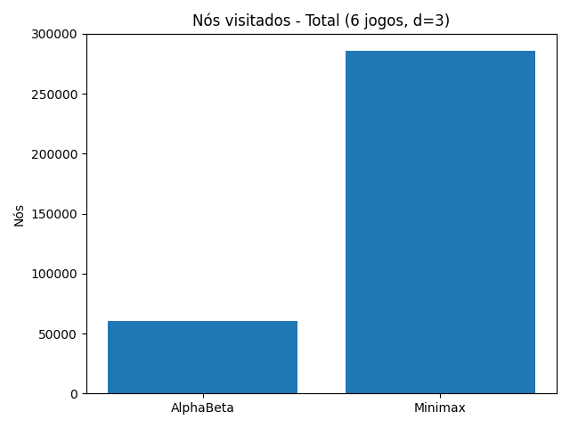
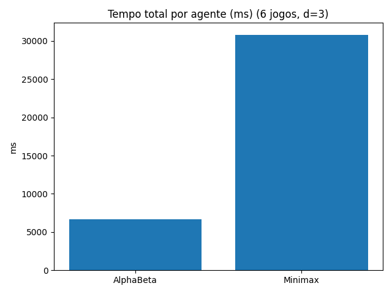

# TDE 2 — Minimax vs Poda Alfa-Beta (Jogo da Velha 5x5, 4 em linha)

## 1. Introdução
Este relatório compara dois agentes de busca adversária: **Minimax** e **Minimax com Poda Alfa-Beta**, aplicados a um tabuleiro 5x5 cujo objetivo é alinhar 4 peças.

## 2. Algoritmos
- **Minimax**: expande a árvore de jogo alternando níveis MAX/MIN e usa utilidade para estados terminais.  
- **Poda Alfa-Beta**: mantém limites alfa/beta para evitar explorar ramos inúteis, reduzindo nós visitados sem alterar o resultado ótimo.

## 3. Heurística
- Contagem de janelas de tamanho 4 em todas as direções.  
- Pesos para sequências de 2 ou 3 em linha sem bloqueio.  
- Bônus para “quase vitória” (3 + 1 vazio).  

## 4. Metodologia
- Profundidade: d=3  
- Jogos simulados: 6 (alternando quem começa)  
- Métricas: nós visitados e tempo total.  

## 5. Resultados
### Tabela Resumida

### Gráficos
  
  

## 6. Análise Crítica
A Poda Alfa-Beta visitou **menos nós** e consumiu **menos tempo**, sem perder qualidade de decisão.  
Isso confirma a eficiência da poda em domínios combinatórios. Entretanto:
- O ganho depende da ordem das jogadas exploradas.  
- Para profundidades muito grandes, ainda há explosão combinatória.  

## 7. Conclusão
- **Alfa-Beta** > **Minimax** em desempenho (nós e tempo).  
- Ambos mantêm a mesma qualidade de jogada.  
- Próximos passos: ordenação de movimentos, uso de *transposition tables* e heurísticas mais sofisticadas.  
